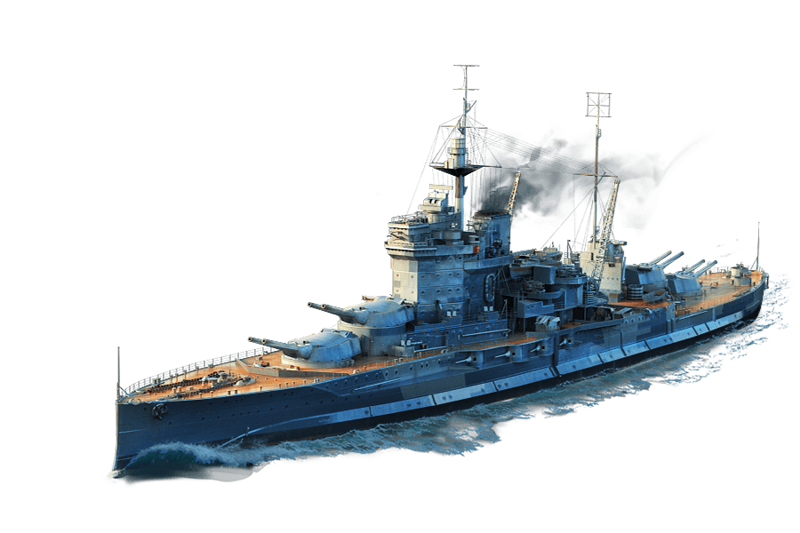

<p align="center">
  
</p>


# **🛳️ Naval Battle**

## **Description**
Naval Battle est un jeu en TypeScript inspiré du classique "bataille navale". Ce projet offre une expérience multijoueur où deux joueurs s'affrontent en plaçant des navires sur une grille et en tentant de détruire la flotte adverse. Chaque joueur joue à tour de rôle, attaque une position, et les résultats des coups sont affichés en temps réel.
Le premier joueur à couler tous les navires adverses gagne la partie.


## **🗺️ Aperçu du Plateau de Jeu**
Voici une représentation typique du plateau de jeu :

```plaintext
     A  B  C  D  E  F  G  H
  1 [ .  .  .  .  .  .  .  . ]
  2 [ .  .  .  .  .  .  .  . ]
  3 [ .  .  .  .  .  .  .  . ]
  4 [ .  X  .  .  .  .  .  . ]
  5 [ .  X  .  .  .  .  .  . ]
  6 [ .  .  .  .  .  .  .  . ]
  7 [ .  .  .  .  .  .  .  . ]
  8 [ .  .  .  .  .  .  .  . ]
```

**Légende :**  
**.** : Zone inexplorée ou intacte.  
**X** : Position d'un navire.  
**@** : Zone touchée avec succès.  
**O** : Zone visée mais manquée.  


## **⚙️ Fonctionnalités**
- **Mode facile** : Les navires ont une taille de 1x1.
- **Placement des navires** : Chaque joueur place ses navires sur une matrice 8x8.
- **Tours de jeu alternés** : Chaque joueur attaque une seule position par tour.
- **Historique des actions** : Un journal des actions est affiché après chaque tour.
- **Affichage dynamique de la grille** : Les grilles des joueurs se mettent à jour en fonction des attaques.

  ---

  

## **📚 Structure du Projet**
```plaintext
├── 📂 public
│   └── 📂 resources          # Fichiers de ressources du jeu
└── 📂 src
    ├── 📂 interfaces         # Interfaces TypeScript pour les données du jeu
    ├── 📂 lib                # Bibliothèques et logique principale
    └── 📂 utils              # Fonctions utilitaires
```

## </> Scripts
**npm run compile :** *Compile le code TypeScript en JavaScript.*  
**npm start :** *Lance le jeu en utilisant la version compilée.*

## ⚙️ Installation

### 1. **Pré-requis**
Assurez-vous que les outils suivants sont installés sur votre machine :
- **Node.js** (version LTS recommandée)
- **TypeScript** (si vous n'utilisez pas Docker)

### 2. **Installation**
1. **Cloner le dépôt** :
Clonez le dépôt GitHub et accédez au dossier du projet :
```bash
  git clone <url_du_dépôt>
  cd <nom_du_projet>
```
## **🚀 Lancement**

1. **Installer les dépendances du projet** :
Installez toutes les dépendances nécessaires au fonctionnement du projet :
```bash
  npm install
```

2. **Compilez le code :**
```bash
  npm run compile
```

3. **Lancez le jeu :**
```bash
  npm start
```

---

## 🌟 Ressources Utilisées
- [TypeScript](https://www.typescriptlang.org/)
- [Node.js](https://nodejs.org/fr)
- [readline-sync](https://github.com/anseki/readline-sync)
- [ETNA Linter](https://github.com/etna-alternance/ETNA-Linter)


# Préparez-vous, plongez dans l'aventure et combattez jusqu'au dernier ennemi ! 💥⚔️ Bonne chance, Capitaine ! 🎮
